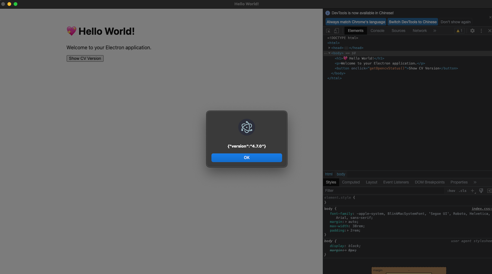

# step 1 `install`

```shell
pnpm install
```

# step 2 `rebuild opencv4nodejs`

```
pnpm run rebuild
```

# step 3 `start`

> You can see the button for opencv work well

###  

```shell
pnpm start
```



# step 4 `package`
> `opencv4nodejs.node` will be copied to the `.webpack/main/native_modules/build/Release` directory.
> <br/>
> You can open app and run success

```shell
pnpm package
```


# step 5 `share App`
> share my app to others <br/>
> It can only work on my local machine, 
> which is the machine used for packaging. 
> If you try to open it using other shared apps, 
> it will generate an error. 

